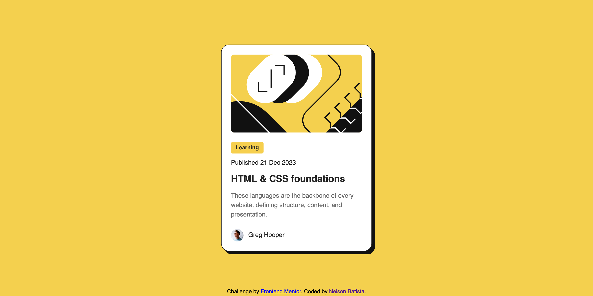

# Frontend Mentor - Blog preview card solution

This is a solution to the [Blog preview card challenge on Frontend Mentor](https://www.frontendmentor.io/challenges/blog-preview-card-ckPaj01IcS). Frontend Mentor challenges help you improve your coding skills by building realistic projects. 

## Table of contents

- [Overview](#overview)
  - [The challenge](#the-challenge)
  - [Screenshot](#screenshot)
  - [Links](#links)
- [My process](#my-process)
  - [Built with](#built-with)
  - [What I learned](#what-i-learned)
  - [Snippets](#snippets)
- [Author](#author)

## Overview

### The challenge

Users should be able to:

- See hover and focus states for all interactive elements on the page

### Screenshot



### Links

- Solution URL: [https://www.frontendmentor.io/solutions/blog-preview-card-plain-html-and-css-KxtQYFL8ud](https://www.frontendmentor.io/solutions/blog-preview-card-plain-html-and-css-KxtQYFL8ud)
- Live Site URL: [https://batistan.github.io/blog-preview-card/](https://batistan.github.io/blog-preview-card/)

## My process

### Built with

- Semantic HTML5 markup
- CSS custom properties
- Flexbox

### What I learned

- Semantic HTML elements
  - Using `p` when appropriate, over `span`
  - Using `article` rather than `div` when appropriate
  - Use of `main` and `footer`
  - Using `address` for attribution, contact information
- Using CSS variables
- Using [BEM](https://getbem.com) to organize CSS
- Less trivial CSS
    - Importing variable fonts from TTF files
    - Animations, transitions
    - Shadows

### Snippets
```css
:root {
    --bg: #F4D04E;
    --bg-card: #FFFFFF;
    --color-text: #232323;
    --color-text-light: #6B6B6B;
    /* ... */
}
```

```css
@media only screen and (max-width: 640px) {
    :root {
        font-size: var(--text-sm);
    }
}
```

```css
.card:hover {
    transform: translateY(-10px);
}
```

## Author

- Website - [Nelson Batista](https://sorou.tech)
- Frontend Mentor - [@batistan](https://www.frontendmentor.io/profile/batistan)
- Bluesky - [@sorou.tech](https://bsky.app/profile/sorou.tech)
